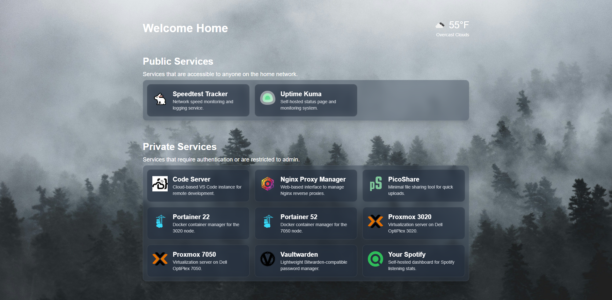

# Home Dash

A dashboard for self-hosted home services.



## Adding Your Own Services

To add a new service to the Home Dash dashboard, you need to update the `services.json` file. This file stores the information for each service displayed on the dashboard, such as the service name, URL, icon, description, and whether the service is private or public.

### Steps to Add a Service:

1. **Locate the `services.json` file**. The file is located in the `src/data/` directory of your project. If it does not exist, create it in this location.

2. **Add a new service**: Each service is represented as an object within an array. Add your new service by following the format below:

```json
[
  {
    "name": "Service Name",
    "url": "https://your-service-url.com/",
    "icon": "/service-icons/service-icon.png",
    "description": "A brief description of what the service does.",
    "private": true
  }
]
```

## Running with Docker

Home Dash supports both **regular Docker** and **Docker Compose**.

### Using Regular Docker

1. Build the image:
   ```bash
   docker build -t home-dash .
   ```

2. Run the container:
   ```bash
   docker run -d --name home-dash -p 3000:3000 --env-file .env home-dash
   ```

3. Stop and remove the container:
   ```bash
   docker stop home-dash && docker rm home-dash
   ```

### Using Docker Compose

1. Make sure Docker Compose is installed.

2. Build and start the container:
   ```bash
   docker compose up -d --build
   ```

3. Stop the container:
   ```bash
   docker compose down
   ```

### Cleaning Up Docker

To remove unused containers, images, and networks:

```bash
docker system prune -a
```

> Note: Ensure you have a `.env` file with any required environment variables before running the container.
